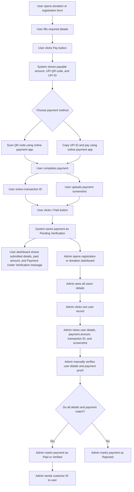

# UPI QR Manual Payment - User and Admin Stories

## User / Farmer Story

As a user/farmer, I want to pay my donation or registration amount using a UPI QR code or UPI ID, so that I can complete the payment using any online payment app and submit proof for verification.

## User / Farmer Acceptance Criteria

1. User can open the donation registration or membership registration form.
2. User can fill all required registration or donation details.
3. User can click on the payment button after entering the required details.
4. System shows the payable amount, UPI QR code, and UPI ID.
5. User can scan the QR code using any online payment app like PhonePe, Google Pay, Paytm, BHIM, or any UPI app.
6. User can copy the UPI ID and pay using any online payment app.
7. After completing the payment, user can enter the UPI transaction ID.
8. User can upload a payment screenshot as payment proof.
9. User can click the `I Paid` button after entering the transaction ID or uploading the payment screenshot.
10. System saves the payment details with `Pending Verification` status.
11. User can see the details submitted in the form.
12. User can see the amount paid.
13. User can see a message like `We will verify your payment`.
14. User can see the payment status as `Payment Under Verification`.
15. Payment should not be marked as paid automatically without admin verification.

## Admin Story

As an admin, I want to manually verify donation and registration payments, so that I can confirm valid payments, reject invalid payments, and send the customer ID after successful verification.

## Admin Acceptance Criteria

1. Admin can open the registration dashboard or donation dashboard.
2. Admin can see all users' submitted details in the dashboard.
3. Admin can click on one user record.
4. Admin can see each detail submitted by the user.
5. Admin can see the payment amount.
6. Admin can see the UPI transaction ID entered by the user.
7. Admin can see the uploaded payment screenshot.
8. Admin can manually verify the user details and payment details.
9. Admin can compare the submitted payment proof with the actual payment received.
10. If all details match, admin can change the status to `Paid` or `Verified`.
11. If the payment proof or user details do not match, admin can change the status to `Rejected`.
12. If verification is successful, admin can send a customer ID to the user.
13. System should keep the payment status as `Pending Verification` until admin changes the status.

## Mermaid Flow Diagram

